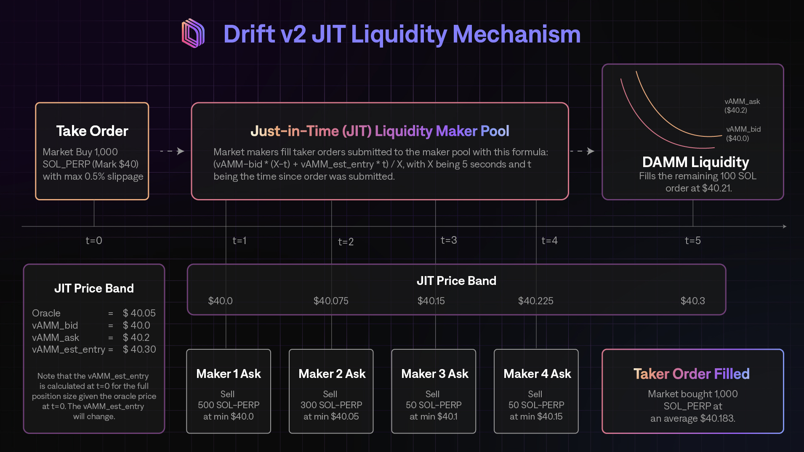

### Introduction

The JIT Auction is a supplementary liquidity mechanism that allows Market Makers (MM) to provide 'Just-in-Time' liquidity.&#x20;

When a user (Taker) submits a market order, this automatically triggers an individualized Dutch Auction with a specific start price, end price, and duration. The auction forces MMs to _compete_ in order to fulfil the user at a price better than or equal to the current auction price. If no MM steps in after the initial window (\~5 seconds), the user can be fulfilled on Drift's AMM.&#x20;

### Auction Price Bands

To maximise on-chain compute efficiency for Makers, the start and end prices within the auction are by default determined based on the oracle price and Drift AMM prices. Like in a regular Dutch auction, the price goes from best to worst (for the Taker, and thus worst to best for the Maker).

This process can be envisioned as a 'price band'; where the upper end of the price band is the worst price the Taker is willing to pay. At the start of the JIT auction (t=0), the price the MM can fill the user at is the price that is furthest away from the maximum price. The price approaches the maximum price as the auction approaches finality (t=5).&#x20;



### The Auction Lifecycle

1.  User submits a market taker order.

2.  The taker order is broadcasted to Drift's Keeper Network, which keeps track of all user orders.&#x20;

3.  The taker order first routes through a Just-In-Time auction where market makers (MMs) can participate in a high-frequency Dutch auction to fill a user’s orders.

4.  The JIT prices typically begin at the oracle price. Makers can bid to fill the desired position.

5.  Should there be no Makers participating in the JIT auction, or should there be any remaining size on the order, the order will be routed through to Drift’s AMM, as an additional source of virtual liquidity.

### How is the Auction Priced?&#x20;

For a **market buy** order:&#x20;

-   The auction by default starts at the oracle price.

-   The auction by default ends at the AMM's ask price

For a **market sell** order:&#x20;

-   The auction will start at the oracle price.&#x20;

-   The auction will end at the AMM's bid price.

:::codeblocktabs

```rust
pub fn calculate_auction_start_price(
    market: &Market,
    direction: PositionDirection,
) -> ClearingHouseResult<u128> {
    let (base_asset_reserves, quote_asset_reserves) = calculate_spread_reserves(
        &market.amm,
        match direction {
            PositionDirection::Long => PositionDirection::Short,
            PositionDirection::Short => PositionDirection::Long,
        },
    )?;

    let auction_start_price = calculate_price(
        base_asset_reserves,
        quote_asset_reserves,
        market.amm.peg_multiplier,
    )?;

    Ok(auction_start_price)
}
```

```rust
pub fn calculate_auction_price(order: &Order, slot: u64) -> ClearingHouseResult<u128> {
    let slots_elapsed = slot.checked_sub(order.slot).ok_or_else(math_error!())?;

    let delta_numerator = min(slots_elapsed, cast(order.auction_duration)?);
    let delta_denominator = order.auction_duration;

    if delta_denominator == 0 {
        return Ok(order.auction_end_price);
    }

    let price_delta = match order.direction {
        PositionDirection::Long => order
            .auction_end_price
            .checked_sub(order.auction_start_price)
            .ok_or_else(math_error!())?
            .checked_mul(cast(delta_numerator)?)
            .ok_or_else(math_error!())?
            .checked_div(cast(delta_denominator)?)
            .ok_or_else(math_error!())?,
        PositionDirection::Short => order
            .auction_start_price
            .checked_sub(order.auction_end_price)
            .ok_or_else(math_error!())?
            .checked_mul(cast(delta_numerator)?)
            .ok_or_else(math_error!())?
            .checked_div(cast(delta_denominator)?)
            .ok_or_else(math_error!())?,
    };

    let price = match order.direction {
        PositionDirection::Long => order
            .auction_start_price
            .checked_add(price_delta)
            .ok_or_else(math_error!())?,
        PositionDirection::Short => order
            .auction_start_price
            .checked_sub(price_delta)
            .ok_or_else(math_error!())?,
    };

    Ok(price)
}
```

```rust
pub fn calculate_auction_end_price(
    market: &Market,
    direction: PositionDirection,
    base_asset_amount: u128,
) -> ClearingHouseResult<u128> {
    let swap_direction = match direction {
        PositionDirection::Long => SwapDirection::Remove,
        PositionDirection::Short => SwapDirection::Add,
    };

    let (_, _, quote_asset_amount, _) =
        calculate_base_swap_output_with_spread(&market.amm, base_asset_amount, swap_direction)?;

    let auction_end_price = calculate_entry_price(quote_asset_amount, base_asset_amount)?;

    Ok(auction_end_price)
}

```

:::

### How does this differ from a RFQ System?&#x20;

Unlike an RFQ system where the Maker has to submit their own prices, the auction prices are already pre-determined based on Drift’s AMM curves based on Drift's inventory-adjusted spreads as mentioned in [Drift AMM](<./Drift AMM.md#CYgWI>).&#x20;

The price of the auction is on-chain and deterministic based on the _time_ of the auction, while in an RFQ, the Maker can submit their own price at any point. As the 5-second auction goes on, the price becomes worse for the Takers and better for the Makers. As a result, Makers need to be as competitive as possible to provide price improvements to traders.

In an RFQ system, the user would receive quotes from Makers that they would have to choose to take or not, but in a JIT auction, the prices would already be predetermined by Drift’s bid/ask curve and would give the user price improvement over Drift’s AMM price.&#x20;
