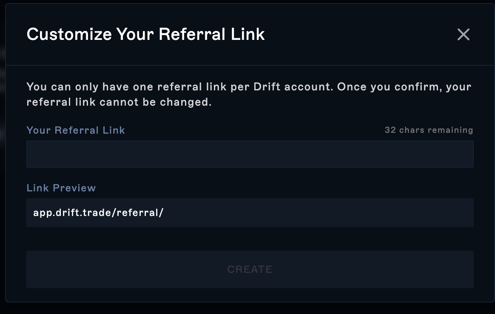
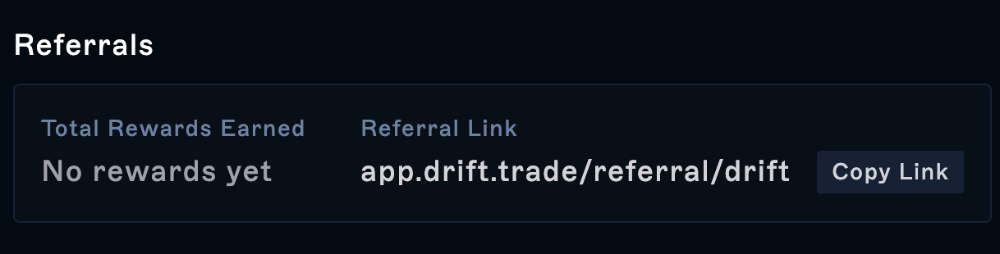

Create your own referral link today and boost your earnings when you refer new users to trade on Drift! For every new user you bring to Drift, you will earn a portion of their trading fees as a reward for bringing on a new user!

Referrers earn **15%** of the fees from users they refer to Drift, and the referred user will also receive a discount of **5%** off their fees! This document will walk you through setting up your referral link to begin earning today.

1\. First, in order to create your own ref link you must click on the “Overview” tab inside the Drift app. Once there you will want to scroll down to where it says “Referrals”.

2\. Once there, click on “Create my referral link”.

3\. Customize your referral link in under 32 characters and click “Create”. **You won’t be able to change your referral link after setting it up the first time. **

4\. Once you’ve approved the transaction, you will find your rewards under “Total Rewards Earned” and a way to copy your link directly to your clipboard.

5\. Share your referral link with your friends and community and you’ll start earning fees from their trading activity!

It’s that easy! \*\*Share your link and start earning today!

\*\*
