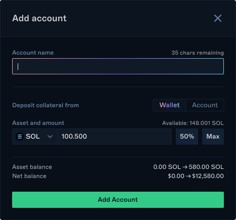
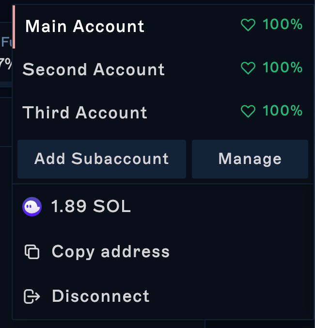

Drift features a powerful subaccount tool for users to clearly separate positions within a single address.&#x20;

Each subaccount's margin and positions are isolated from other subaccounts, meaning that users can trade on isolated margin via different subaccounts.&#x20;

Each subaccount has independent positions, balances and margins, and can trade independently. Balances or liquidations from each subaccount will not affect other subaccounts. Each subaccount is cross-margined.

### Adding a Subaccount

Here's how you can add a subaccount:

1.  Go to the account dropdown in the top right of the app.

2\. Click "Add Subaccount."

3\. You'll be asked to name your new subaccount and deposit collateral from your wallet to fund that account. You can also transfer collateral to your new subaccount from an existing one to fund it.

### Editing and Deleting a Subaccount

You can edit the subaccount name at any time by clicking the edit icon in the account-switcher function. Editing & deleting a subaccount is also possible under the Manage Subaccounts page in your Account Overview.&#x20;

### Switching Subaccounts

Once you've created a new account, you can use the same account switcher to move between them.

### Managing Subaccount Assets

You can easily manage your assets via the Accounts button in the top navigation, via the Balances & Interest page in your Overview, or the Manage Subaccounts page in the Overview.

Navigate to the Balances & Interest page within your portfolio to get an overview of the assets you've deposited. To see the assets of a single subaccount, use the account switcher in the left navigation to switch to that account.

From the Balances & Interest page or the Manage Collateral window, you can:

-   Deposit additional assets

-   Withdraw to your wallet

-   Transfer assets between accounts

Here's how you can access it via the navigation bar:

