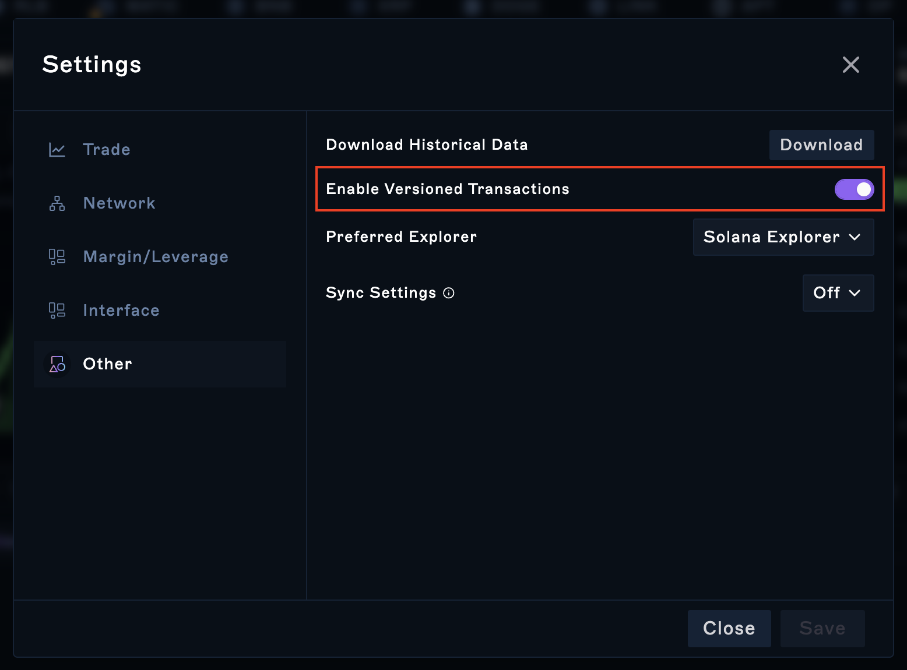

[Solana added Versioned Transactions](https://docs.solana.com/developing/versioned-transactions) to enable additional functionality in the Solana Runtime. These changes improved the capabilities of Solana dapps, but they have created some compatibility problems because unfortunately not all products in the ecosystem have integrated them.

One of the biggest compatibility problems is in detecting whether a wallet supports versioned transactions or not. For example, WalletConnect has added support for Versioned Transactions, but most\* of the underlying wallets have not.

### Why do I care about versioned transactions?

If your wallet supports versioned transactions, you don't need to worry and everything on the Drift UI should work as expected without a hiccup (as long as you have versioned transactions enabled in Drift, the default setting).

If your wallet does not support versioned transactions, you will currently not be able to use Drift's spot swap functionality, as this feature currently only works with versioned transactions.

### How do I enable versioned transactions in Drift?

By default versioned transactions should be enabled, but you can double-check and edit this setting by going to Settings -> Other -> Enable Versioned Transactions

### How do I know if my wallet supports versioned transactions?

Probably the easiest way to tell is just to turn versioned transactions on, and test whether you are able to interact and make Drift transactions as expected. If you are, then your wallet supports versioned transactions, if not it doesn't. Your wallet may specify its capabilities in its own documentation.

### Tips for users whose wallets don't support versioned transactions

If you don't intend on using swaps in Drift, then you should be able to continue to use the product as usual\*\*. But if you _would_ like to switch to a wallet which does support versioned transactions, then here are some wallets which we can confirm support versioned transactions based on our own testing\*\*\*.

-   [Phantom](https://phantom.app/)

-   [Solflare](https://solflare.com/)

-   [Backpack](https://www.backpack.app/)

-   [Brave Wallet](https://brave.com/wallet/)

---

\* Based on results of manually testing a range of WalletConnect-supporting wallets. This is by no means exhaustive, and is expected to change over time.

\*\* This may change in the future

\*\*\* Note : We have not exhaustively checked all wallets, and **this is not an endorsement of the security practises of the wallet provider**. You should do your own research when choosing a wallet.
