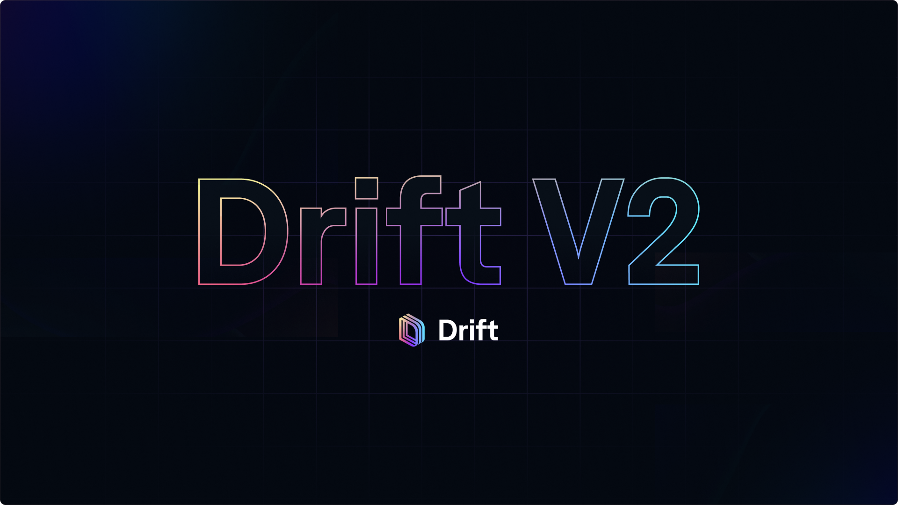

## What is Drift?

Drift Protocol is an open-sourced, decentralised exchange built on the [Solana blockchain](https://solana.com/), enabling transparent and non-custodial trading on cryptocurrencies.

By depositing collateral into Drift Protocol, users can:&#x20;

-   trade perpetual swaps with up to 10x leverage,

-   borrow or lend at variable rate yields,&#x20;

-   stake / provide liquidity,

-   swap spot tokens

## Why use Drift?

The full suite of DeFi tools within the protocol are powered by Drift's robust cross-margined risk engine, designed to give traders a balance of both capital efficiency and protection (m*ore details of the cross-margin engine design are detailed throughout "Technical Explanations").*

Under the cross-margin engine, each tool extends functionality within the protocol without over-extending risk. For instance:

-   the borrow / lend markets also enable cross-collateral on perpetual futures and more efficient margin trading on spot assets

-   every deposited token is eligible for yield on deposits from borrows and provides margin for perpetual swaps

-   borrowers are only eligible to borrow from depositors in an over-collateralised fashion while passing multiple safety measures

The protocol's orderbook, liquidity, and liquidation layer is powered by a validator-like Keeper Network. Keepers are a network of agents and market-makers incentivized to provide the best order execution (i.e. Just-In-Time (JIT) liquidity, order matching, etc.) to traders on Drift. The Keepers can route orders throughout the multi-sourced liquidity mechanisms that are designed to effectively scale and offer competitive pricing even with larger order sizes.

# Quick Links

::::link-array
:::link-array-item{headerType="IMAGE" headerImage="https://archbee-image-uploads.s3.amazonaws.com/ps_9Ff-LBbQB7IaXI3f3F/wgvxfo_VPFR7LxlZuTlE3_02phrases1.png"}
[Getting Started](<../Drift Protocol v2 Docs/Getting Started.md>)
:::

:::link-array-item{headerType="IMAGE" headerImage="https://archbee-image-uploads.s3.amazonaws.com/ps_9Ff-LBbQB7IaXI3f3F/9UwwmuenoAV533je_epwT_02phrases4.png"}
[Just-In-Time (JIT) Auctions](<../Drift Protocol v2 Docs/Just-In-Time _JIT_ Auctions.md>)&#x20;
:::

:::link-array-item{headerType="IMAGE" headerImage="https://archbee-image-uploads.s3.amazonaws.com/ps_9Ff-LBbQB7IaXI3f3F/G6Banz-W4PNUEIljrqfo1_pvuy0ensaqopmsis66txv02phrases2.png"}
[Tutorial: Arbitrage Bot](<../Drift Protocol v2 Docs/Tutorial_ Arbitrage Bot.md>)
:::

:::link-array-item{headerType="IMAGE" headerImage="https://archbee-image-uploads.s3.amazonaws.com/ps_9Ff-LBbQB7IaXI3f3F/caNNkmMAC-_rPd2341YQ1_yyrmtkw9rurlhcw5bamdc02phrases3.png"}
[Keepers & Decentralised Orderbook](<../Drift Protocol v2 Docs/Keepers _ Decentralised Orderbook.md>)
:::
::::
