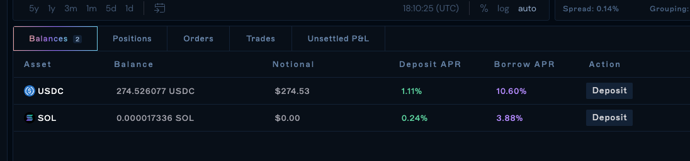

Spot Trading is the direct purchase or sale of an asset. The delivery of the assets is immediate and the transaction settles on-chain. Once the spot trade has been confirmed, the settlement will be instantaneous, and you will be able to see the increase or decrease in the asset immediately in your account balances.&#x20;

Spot trading on Drift v2 uses liquidity from OpenBook DEX as well as our own DLOB. By default, margin trading is not enabled. Learn how to enable it in the next section.

1\. Select the SOL / USDC market in the top bar or the market's dropdown menu

2\. Select your direction (e.g. Buy or Sell) and order type (e.g. Market, Limit)
3\. Input the asset amount you'd like to trade or the notional value

5\. Once you've confirmed your order and it has been filled, your Balances tab will update to reflect your balance changes

## Enable Spot Margin Trading

Margin needs to be enabled per subaccount. Here's how you can enable margin:

Margin trading allows you to leverage your assets as collateral to borrow funds for the trade. The leverage a trader can take in each spot market is determined by the protocol's risk engine.

1.  Open Settings

2.  Go to Margin Trading in the left navigation

3.  Click the toggle to enable it for the subaccount you want

4.  Sign the wallet transaction to confirm

Once margin is enabled, you should see the leverage bar appear in the trade form.

**Spot margin trading example:**

1.  Select the SOL / USDC spot market

2.  Select the BUY side in the trade form and your order type

3.  Enter the amount you'd like to purchase or use the leverage slider

4.  Click "BUY SOL"

5.  Once the order is filled, your balances tab will update with the asset amounts you've purchased and the amount you've borrowed (if applicable)

