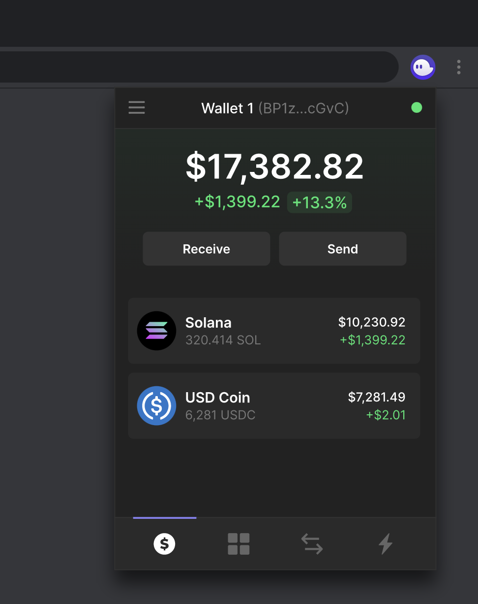

### 1. [Install Phantom wallet](https://phantom.app/) on your preferred browser (Chrome, Brave, Firefox, Edge).&#x20;

### 2. Ensure your Phantom Wallet has SOL and USDC or other assets to trade on Drift

You can deposit SOL to cover trading fees on your Phantom wallet. If you don't have SOL yet, you can purchase SOL on an exchange and withdraw SOL to your Phantom wallet.

You can then swap any asset in your wallet for USDC or other assets that are accepted as margin for cross collateral (SOL, BTC and ETH) within the Phantom interface itself, or on [Jupiter](https://jup.ag/swap/SOL-USDC). Check out [Cross-Collateral Deposits](<./4 Cross-Collateral Deposits.md>) to see which assets are accepted as deposits on Drift.

### 3. Connect your Wallet&#x20;

Navigate to our trading page. On the top right side of the page, select "Connect Wallet."&#x20;

### 4. Deposit USDC on Drift

Click on the "Deposit" button located next to the button you connected your wallet with and choose the amount you want to deposit.

You can change which asset you'd like to deposit by choosing your desired asset from the drop-down.

### 5. Withdraw USDC from Drift&#x20;

If you want to withdraw from Drift, select "Withdraw" inside the same window you used to deposit and choose the amount you want to withdraw. Select the amount you want to withdraw and confirm the transaction.&#x20;

