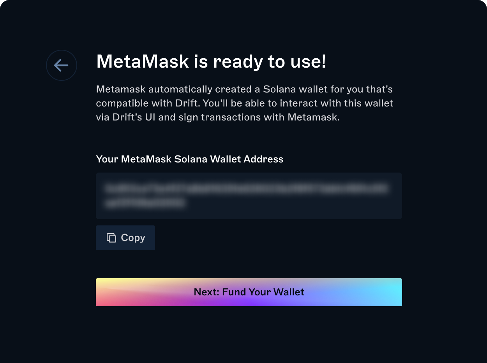

With CONNECT by Drift, MetaMask can be used to trade and sign transactions on Drift. CONNECT by Drift is an open source wallet extension that is powered by [MetaMask Snaps](https://metamask.io/snaps/), an innovation that extends the functionality of the MetaMask platform to other chains.

:::hint{type="info"}
Note: MetaMask Snaps is in open beta and is available for you to use at your own risk. If you're experiencing any issues, you can reach out to our team via [discord](https://discord.gg/YaK2a5ge).
:::

## Getting Started

### 1. Connect your MetaMask wallet

Click connect in the top right corner to get started. If you have MetaMask already installed, CONNECT will automatically detect this. Select MetaMask to continue.

### 2. Install MetaMask Snaps

If this is your first time interacting with MetaMasks Snaps, you'll be prompted within MetaMask to install it.

### 3. Connect to Drift

Next, you'll be prompted to connect to Drift via MetaMask Snaps.

Once you connect, a new Solana compatible wallet will be automatically created for you in MetaMask.

### 4. Fund your wallet

To start trading on Drift, your new MetaMask wallet will need some SOL for transaction fees and you'll need to deposit collateral to Drift. The onboarding flow will guide you from one step to the next.

You can use [Mayan Cross Chain Swaps](https://mayan.finance/) to bridge assets over from your EVM wallet to your Solana wallet, including gas drop off, all in one step!

If you'd like to fund your new MetaMask wallet from another Solana wallet, select "Fund from another wallet" for a step-by-step guide.

### 5. Deposit Collateral to Drift

Once funds have been added to the wallet, you're now ready to deposit collateral to Drift for trading.

If you've exited the onboarding flow, you can click on `Bridge` to use Mayan Swaps or Wormhole. To deposit collateral, you can click on the `Deposit/Withdraw` button.

### 6. Managing funds in your MetaMask Solana Wallet

MetaMask Snaps is currently in Open Beta and does not yet support viewing funds/balances from within MetaMask itself. You can view your MetaMask Solana Wallet balances within Drift by accessing the account dropdown and selecting `Manage Metamask Wallet`.

:::hint{type="info"}
Note: Drift can only display the balances in your MetaMask Solana wallet, you have full control over these funds.
:::

##

## CONNECT by Drift FAQs

### **What is CONNECT by Drift?**

CONNECT by Drift is an open source wallet connector powered by MetaMask Snaps, allowing users to interface with any Solana dApp using their Metamask wallet.

### **What is MetaMask Snaps?**

MetaMask Snaps extends the functionality of the MetaMask platform, allowing users to interact with any dApp on any chain with the same security and a familiar UI. You can learn more about MetaMask Snaps [here](https://metamask.io/snaps/).

### Where can I find my private key or seed phrase?

Drift doesn't have access to your private keys or seed phrase. You can export your seed phrase from MetaMask directly to import into another wallet of your choice.

### Does CONNECT by Drift work on mobile?

Not yet. Once MetaMask announces support for mobile, we'll be sure to include it!

### **Can I install other Snaps?**

Yes, you'll be able to install and use other snaps.&#x20;

### W**hy am I'm having trouble connecting to other dApps?**

Sometimes wallet adapter software can be out-of-date. Visit the discord of the dApp you're trying to connect to and determine if they've added CONNECT by Drift to their wallet adapter.

### **Can I use Connect for my own dApp?**

Yes! You can add CONNECT by Drift to your dApps' wallet adapter by installing the [npm package](https://www.npmjs.com/package/@drift-labs/snap-solana). CONNECT by Drift is also open source, you can view the code here if you'd like to develop you're own MetaMask Solana Snap.
