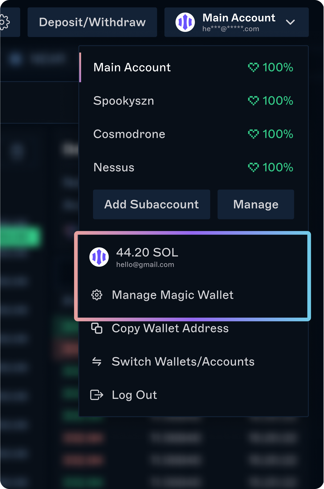

You can get started on Drift quickly and securely without any passwords or seed phrases to access your account or funds.

You can sign up/log in with your email. Social logins are coming soon.

### How does passwordless login work?

When you sign up for Drift with your email, a [Magic Wallet](https://magic.crisp.help/en/category/magic-wallet-user-faq-1xtseie/) is automatically created for you. This is a non-custodial crypto wallet associated with your Drift account that you have sole control over.

Here’s what you can expect when you sign up with email:

1.  **Sign up with an email**

    -   No password is required, you’ll be prompted to authorize via email

        -   An authentication email will be sent to you each time you want to log in.

    -   Once authorized, the sign-in page will reload and a Magic Wallet will be created for you.

        -   Magic Wallets are provided by [Magic Link](https://magic.crisp.help/en/category/magic-wallet-user-faq-1xtseie/)

        -   This is a non-custodial wallet

    -   In the future, if you prefer to connect with your own Solana wallet to Drift, you can do this at any time and a new Drift account will be created

2.  **Your Magic Wallet address and private key**

    -   At this step, you’ll be presented with your wallet address and private key to store. You can retrieve your private key at any time.

    -   Drift and Magic Link do not have access to your Magic Wallet or Private Keys and won’t be able to help you recover it if you lose access.

3.  **Deposit SOL and collateral**

    -   A small amount of SOL in your wallet is needed for transaction fees and you’ll also be asked to deposit assets onto Drift as collateral for trading

    -   You can fund your wallet from another wallet or centralized exchange using the QR code.

        Need help depositing/transferring funds?
        [Transferring funds from Binance, Kraken, and Coinbase](https://www.drift.trade/learn/how-to-transfer-funds-from-a-cex-onto-drift)
        [Transferring funds from another chain (e.g. Ethereum)](https://www.drift.trade/learn/how-to-bridge-assets)

4.  **Start trading**

### FAQ

**What is Passwordless Authentication?**

Neither Drift nor Magic Link sets or keeps passwords used for authentication. When you sign up with email, a Magic Link email is sent to that address to authorize sign-up and log-in requests. Passwordless authentication eliminates use cases where users’ passwords can be phished. Learn more.

**Is Magic Wallet a noncustodial wallet?**

Your Magic Wallet is noncustodial, meaning you have complete control over your private keys and funds inside the wallet. Drift and Magic Link do not have access to your wallet or passwords.

**Is Magic Wallet secure?**

Magic Wallet uses a Delegated Key Management system that is secured by Hardware Security Modules (HSMs). These HSMs are similar to hardware-based wallets like Trezor or Ledger but they sit on the cloud and are secured by AWS data centers.

In addition to this, Magic Link is SOC2-Type 2 and GDPR compliant — meaning the effectiveness of their security and privacy procedures have been audited.

To learn more about security, deep dive into Magic Link's [whitepaper](https://magic.link/docs/home/security).

**Where can I find my wallet address?**

1.  In the top right-hand corner of the app, click on the account button to reveal the dropdown

2.  Click on "Manage Magic Wallet" (see screenshot)

3.  Your wallet address will be located below your wallet balance

**Where can I find my private key?**

1.  In the same wallet modal, click on the 3-dots menu and select "Get Private Key".

2.  You'll be connected to a secure site to retrieve it

**How can I set up Multifactor Authentication (MFA) for my Magic Wallet?**

MFA is coming soon!
