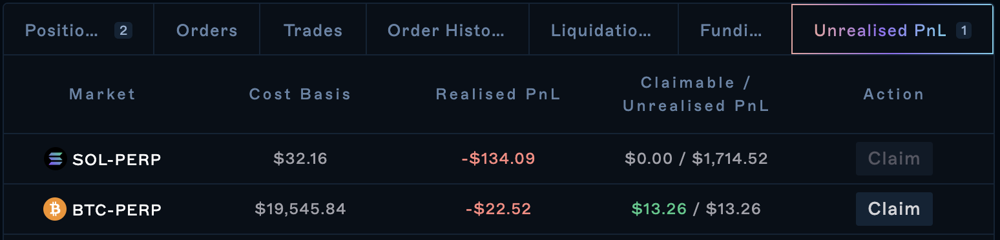

## Introduction

Profit and Loss, often referred to as P\&L or PnL, is a term used to describe the current state of a user's active positions while trading. By observing P\&L users will be able to determine whether their positions are either in profit or loss.

A user's current position on Drift is the cumulative sum of all their filled orders (increasing, reducing, or closing) over time. All trading lots, per market and per subaccount, are combined into a single position to determine P\&L.&#x20;

The position table below shows the **P\&L **for the current position. Users can toggle "$" or "%" to change whether they would like to see **P\&L **in dollar terms ($) or in percentage terms (%).

In the above image, the P\&L refers to the **unrealised P\&L **or **uPNL **of the open positions (SOL-PERP and ETH-PERP shorts). To realise this P\&L, users will have to close their positions.&#x20;

The PnL in the table above is calculated as the difference between the position's `Entry Price` with the current oracle price multiplied by the `Size`.

## Withdrawing Realised P\&L

A user's realised P\&L can only be withdrawn once it has been settled/claimed on-chain.&#x20;

**\*Note: \*\***realising P\&L by closing the position is **_not_** the same as settling/claiming P\&L. To withdraw a positive P\&L, it must be settled/claimed first. \*

### Settling and Claiming your P\&L

To update the USDC balances available for withdrawal, your P\&L must first be settled and claimed.

To do so, navigate to the `Unrealised PnL` tab and select `Claim`

Users can claim positive P\&L when:

1.  the open position has been closed or reduced (i.e. your uP\&L has been partially or wholly realised); _note: this step is only necessary when the pnl pool balance is limited _

2.  the market's P\&L Pool has available balances to claim; and&#x20;

3.  their Cost Basis is below the Entry Price for longs or above the Entry Price for shorts.

## What is the difference between Settling P\&L and Realising P\&L?

The main difference between settling P\&L and realising P\&L is that realised P\&L is available to be withdrawn and used elsewhere whereas settled P\&L is not.&#x20;

Once realised, your P\&L must also be settled and claimed before it can be withdrawn.

### Realised P\&L

Realised P\&L refers to the profit and loss that is realised by the user when they close their position.&#x20;

For example:&#x20;

-   If you entered a long position on SOL at $30 and SOL is now $60; you would be in profit with an unrealised P\&L of $30.&#x20;

-   Similarly, if you entered a short position on SOL at $30 and SOL is now $15; you would be in profit with an unrealised P\&L of $15.&#x20;

The profit and loss in both those examples are known as **unrealised P\&L** (uP\&L) as that position is still open. The uP\&L of the position will continuously change as the price of the asset changes.&#x20;

Your P\&L will not be **realised** until you close your position. Once you close your position, your uP\&L will become **realised P\&L** and you will be out of that perpetual futures position (i.e. you will no longer have exposure to the price movement of that underlying asset).&#x20;

### Settling P\&L

Settling P\&L refers to settling the total funds available in the per-market pool of funds that users can claim.&#x20;

This pool is called the **P\&L Pool** (read more here: [Accounting and Settlement](<./1 Accounting and Settlement>)).&#x20;

A trader that has made a profitable trade and realises its profits may wish to withdraw that realised profit.

However, users can only withdraw realised profits if there is enough settled P\&L available in the P\&L Pool. The P\&L Pool is comprised of all the accumulated realised losses of other participants in that market. It represents the total amount available for withdrawal.

For each dollar to be withdrawn from realised profits, there must also be a corresponding dollar of realised losses (which will be made available in the P\&L Pool). This mechanism exists to ensure that users do not withdraw more from the platform than what actually exists.

If a user made a profitable trade and has a positive realised P\&L from the position, but there isn't enough Settled P\&L in the Per-Market P\&L pool to pay out the user to withdraw, the user may need to wait for the pool to be replenished by settled losses.&#x20;

When this occurs, the user's P\&L will be considered to be **unsettled P\&L. **

For more information on what happens when there is not enough Settled P\&L, read [P\&L Pool](<./2 P_L Pool>)

### Margining of Unsettled P\&L&#x20;

If positive P\&L is unsettled, it may account for less initial margin for trading perpetuals than USDC. Please see the treatment of non-USD assets here [Cross-Collateral Deposits](<../Getting Started/4 Cross-Collateral Deposits>)

Each market has a maximum imbalanced P\&L limit. When the net user P\&L in a market breaches the limit, the asset weight will be decreased. Additionally, P\&L in excess of the limit is subject to deficit resolutions from the Insurance Fund (up to the market's max insurance fund limit).&#x20;

:::hint{type="info"}
Discounting the unsettled P\&L lowers the maximum leverage extended for users (and only decreases a user's initial margin).&#x20;

These guards don't lower the maintenance margin weights and are not relevant for liquidations.&#x20;
:::

### Withdrawals

Only the lesser value of your Free Collateral and Asset Balance will be available for withdrawal (without opening a borrow). Realising positive unrealised P\&L (by reducing/closing positions) will allow for that P\&L to be settled to your Asset Balance for withdrawal.

:::hint{type="info"}
A suggestion for users that want to stay in their position and withdraw unrealised profits in excess of their asset balance is to reduce/close then reopen the position.&#x20;
:::

Read more in [[[Glossary](docId\:ZJk_O3cU0Y-rkJFoSY64T) ](https://docs.drift.trade/glossary)](https://docs.drift.trade/glossary)
