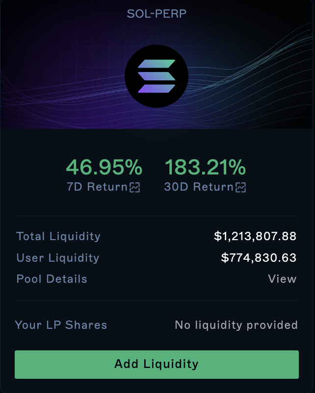
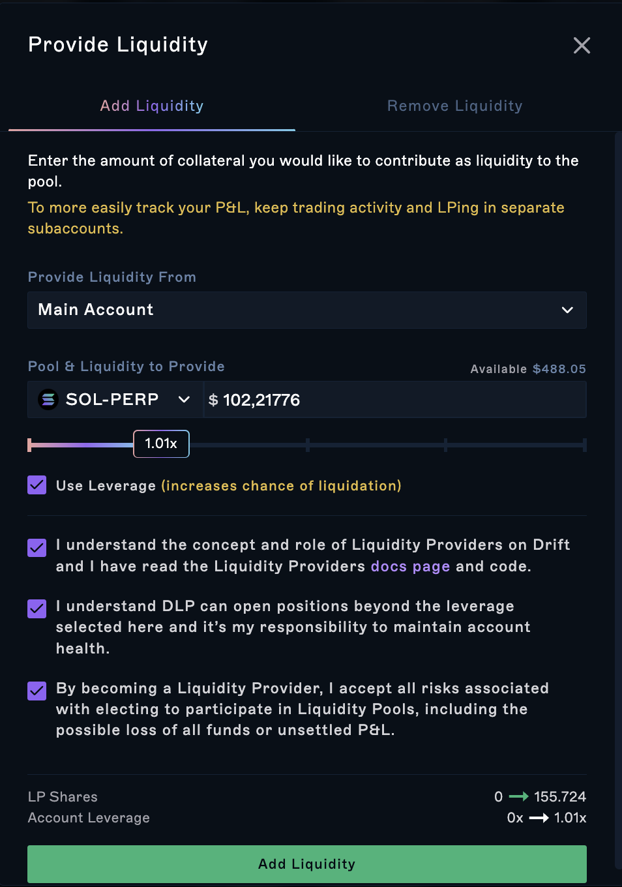
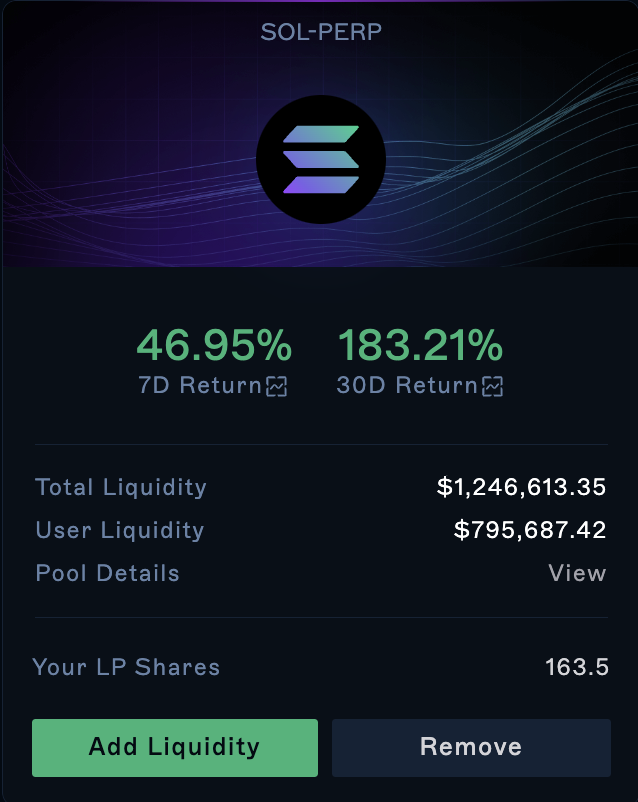
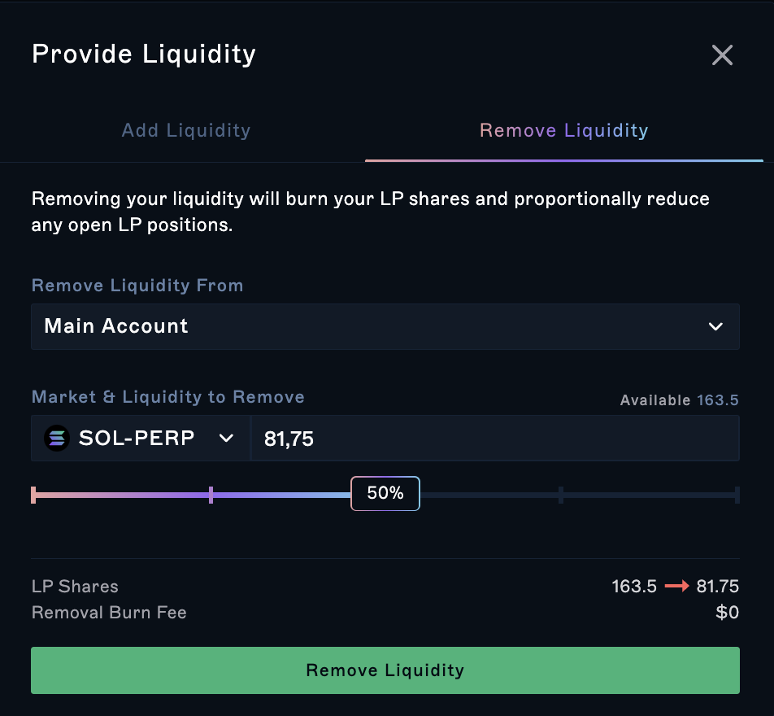
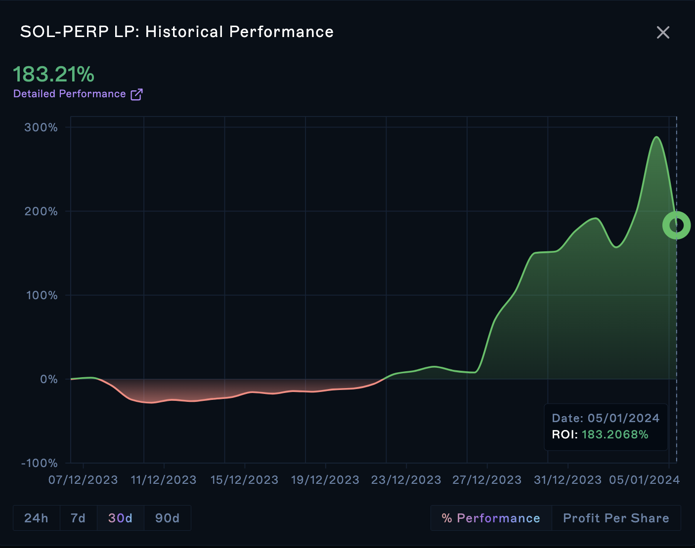
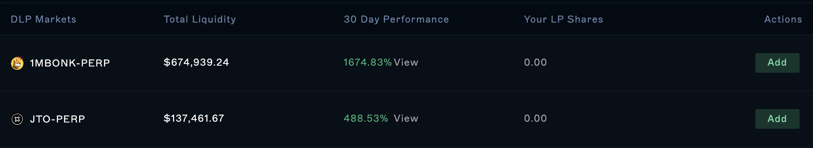

### Overview

Users that elect to use DLP and provide liquidity will be able to select which market they'd like to provide liquidity to. By doing so, the user becomes an LP.

Providing liquidity increases the total pool of liquidity available within that market by increasing ***K***. In turn, this lowers slippage and reduces price impact resulting in an overall better trading experience for other users.&#x20;

Since the liquidity added to a perpetuals market is cross margined within Drift, you'll continue to earn lending interest and have capital available for margin trading.

For an in-depth overview of how DLP works, please see [Liquidity Providers (LPs)](<./1 Liquidity Providers _LPs_>)

### How to add liquidity

To add liquidity to a perpetual market:

1.  Select the market you'd like to be an LP for and click `Add`

2.  In the modal, enter the amount you'd like to provide or the leverage

3.  Click `Add`

You may be prompted to create a subaccount for DLP. This is highly recommended in order to easily track DLP and trading P\&L.

### How to remove liquidity

You can remove liquidity from the Trading page under the positions tab or you can access it from the DLP page:

1.  Click `Remove`

2.  Select the amount of shares you'd like to remove

3.  Click `Remove Liquidity`

### How to view the historical performance for each market

There are 2 ways to access historical performance:

1.  You can click on the 7D or 30D performance in each markets card

2.  or, in table view, you can click `View Performance` under the 30D Performance column

