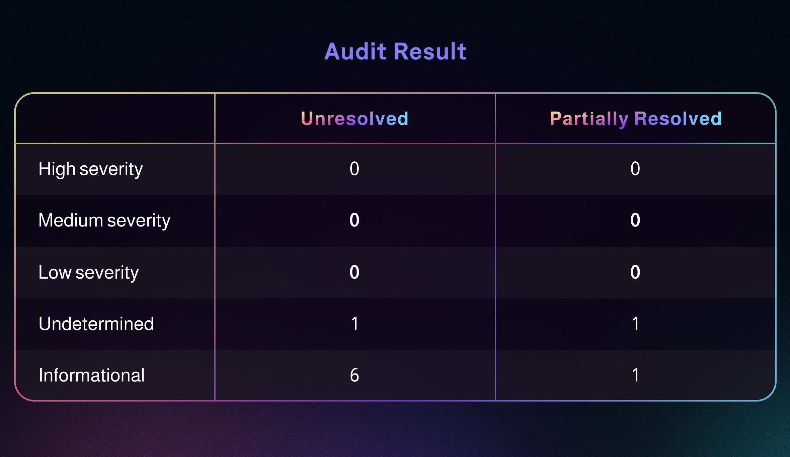

### Trail of Bits

**Overview**

Drift Protocol engaged Trail of Bits (TOB) to audit the security of its decentralized exchange and smart contract. Founded in 2012 and headquartered in New York, TOB provides technical security assessment and advisory services and specializes in software testing and code review projects. TOB is recognized as a Tier-1 security auditor, having worked with notable clients such as Google and Microsoft.

From November 7 to December 2, 2022, the TOB team conducted a security audit of Drift Protocol’s decentralized exchange. TOB’s testing efforts were focused on the identification of flaws that could result in a compromise of confidentiality, integrity, or availability of Drift’s decentralized exchange and smart contract. The audit was conducted by TOB with full knowledge of the target system, including access to the source code and documentation. TOB utilized a mix of static and dynamic testing of the target system and its codebase, using both automated and manual processes.

## Audit Result

The audit did not uncover any high-severity flaws that could impact system confidentiality, integrity, or availability. After the initial audit findings, between January 23 and January 25, 2023, Trail of Bits reviewed the fixes and mitigations implemented by Drift Protocol to resolve the issues described in this report.

_A summary of outstanding findings is shown below._

A full listing of unresolved or partially resolved findings can be found on page 73 of the TOB Audit Report (Report). The undetermined finding relates to Testing code used in production and is described in further detail on page 77 of the Report.

View the full report [here.](https://www.drift.trade/audit)

###
