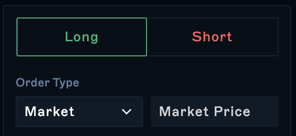
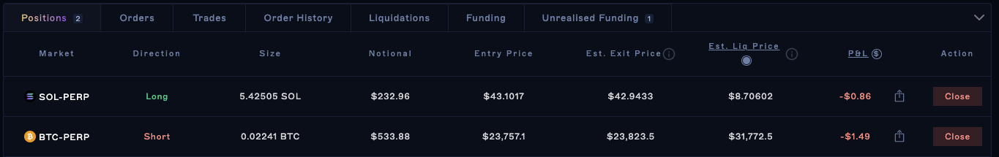

## Choosing Markets

Select the market you would like to trade by clicking `Trade` followed by `Perpetuals` and choose your desired market.

Select Long (Buy) or Short (Sell) from the top of the trading form and then select your order type.

Drift offers Market and Limit Orders that you can use to manage risk. If you are a beginner and just want to buy the perpetual contract at its current price then go with a Market Order. To read more on Market Orders, you can read about it on [Order Types](<../Trading/6 Order Types.md>).

## Selecting Position Size and Leverage

Enter the amount of the underlying asset you want for your position. You can do this in three different ways:

-   Using text input on the left, you can enter the amount of the underlying asset you would like.

-   Using the text input on the right, you can enter how much USDC collateral you want to use.

-   Or, you can use the leverage slider or the buttons below it to change the size of your position. The slider will automatically show how much leverage you are using.&#x20;

You can also set your maximum allowed slippage for your position.

## Opening a Position

When you're ready to open the position, click the button at the bottom of the Trade form. A confirmation modal will appear so you can review the details of your trade and make sure all the details are correct before you continue. Finally, you will be asked to sign the transaction with your connected wallet.

## Adjusting an Open Position

If you have an open position, you can make adjustments by either buying or selling the same asset. To adjust your position follow the same steps outlined above for the relevant asset. Changes in the leverage you use will also change your liquidation price.

## Closing Positions

Once you are done with a trade, you can close out of that position. Go to your positions under the "Positions" tab and click "Close" to realise your P\&L. Be sure to sign the transaction via your connected wallet.

Your Balances and Total Collateral should reflect this if you have no Unrealised P\&L left.
