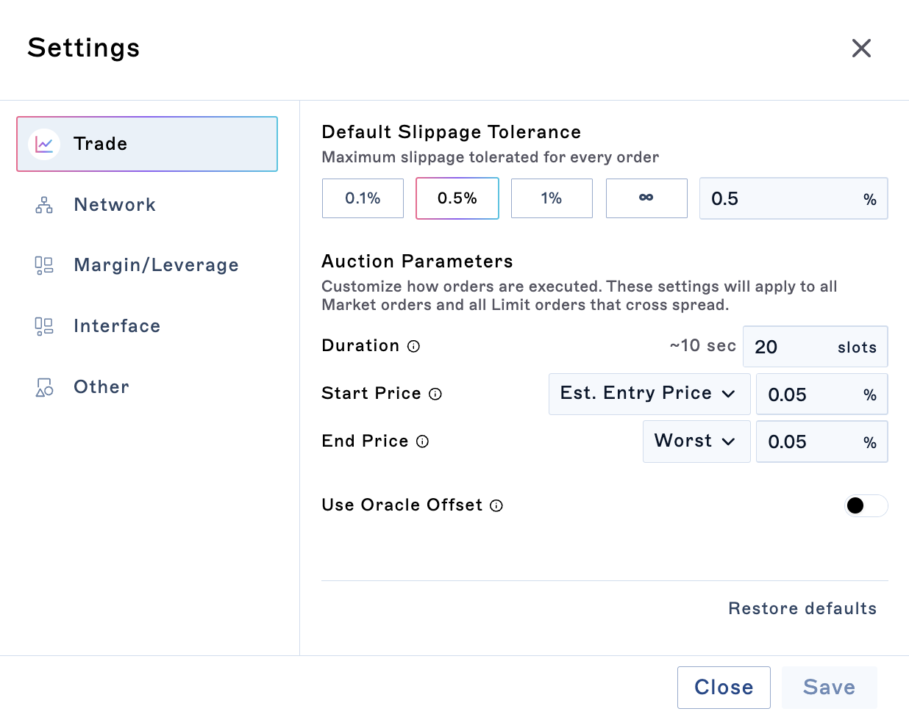

Drift Protocol allows orders to set custom auction parameters.&#x20;

These settings allow users to customize how their orders are executed on the Drift Protocol by setting specific auction parameters. You can see the implementation of these auction settings [here](https://github.com/drift-labs/drift-common/blob/master/common-ts/src/common-ui-utils/commonUiUtils.ts#L374).

:::hint{type="info"}
**Double Check:** One can always review their Auction Parameters for a particular order in the Confirmation Modal before submitting.&#x20;
(you can expand details with "Advanced" checked)
:::

**
Start Price Fields: **

1.  Oracle Price (current oracle price of the market)

2.  Best Bid/Ask (use best bid/ask price)

3.  Est. Entry Price (price includes estimated price impact on DLOB/AMM)

4.  Best Overall (select best price of all of the above)

:::hint{type="info"}
**For Large Size:** its recommended to set a longer duration, "Use Oracle Offset", and wider start, end buffers.
:::

With Drift Protocol, users can determine the duration of their order in 'slots', and set starting and ending prices based on the keeper network's view of the DLOB.

For the given specifications above:

-   the user wants the order to start at a price 0.05% better than the estimated fill price.

-   The order will end at a price that's the worst fill, but with a safety buffer of 0.05% slippage.

-   This entire process will take place over 20 slots, which is roughly 10 seconds.

-   If the order isn't fully executed within this time, any remaining amount can be filled at a price 0.5% worse than the estimated entry price up to the order's expiry. Note: By default, market orders expire after 60 slots.

Additionally, user's can specify their auctions as offsets from oracle price. This means during the auction (and at runtime) the auction is dynamically moving with the oracle prices as they update (increasing the chance of fair value fills).

### Auctions for Limit Orders

When submitted limit orders crosses local DLOB and/or vAMM, a limit order without post only flag will actually submit an auction first. The limit order uses the user defined rule for start price for its start auction param. It effectively the same as a market auction order **except the user explicitly overrides the End Price and Slippage Tolerance Limit Price.**
